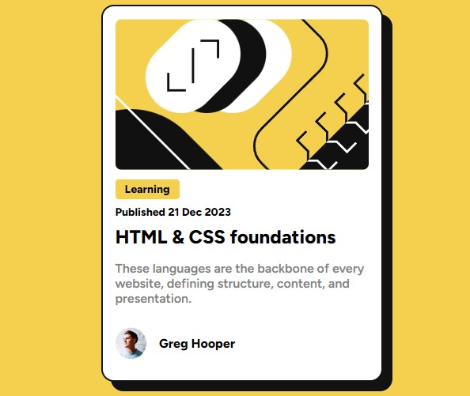

# Frontend Mentor - Blog preview card solution

This is a solution to the [Blog preview card challenge on Frontend Mentor](https://www.frontendmentor.io/challenges/blog-preview-card-ckPaj01IcS). Frontend Mentor challenges help you improve your coding skills by building realistic projects. 

## Table of contents

- [Overview](#overview)
  - [The challenge](#the-challenge)
  - [Screenshot](#screenshot)
  - [Links](#links)
- [My process](#my-process)
  - [Built with](#built-with)
  - [What I learned](#what-i-learned)
  - [Continued development](#continued-development)
- [Author](#author)
- [Acknowledgments](#acknowledgments)

## Overview

### The challenge

Users should be able to:

- See hover and focus states for all interactive elements on the page

### Screenshot

### Links

- Solution URL: [https://github.com/robbiedob21/blog-preview-card-main](https://github.com/robbiedob21/blog-preview-card-main)
- Live Site URL: [https://robbiedob21.github.io/blog-preview-card-main/](https://robbiedob21.github.io/blog-preview-card-main/)

## My process

### Built with

- Semantic HTML5 markup
- CSS custom properties
- Flexbox

### What I learned

- I have practiced using custom properties after watching a Kevin Powell video using them.
- I also learned how to use github to share my projects

### Continued development

- I need to continue to improve working with images in html/css.

## Author

- Frontend Mentor - [@robbiedob21](https://www.frontendmentor.io/profile/robbiedob21)

## Acknowledgments

- [Kevin Powell](https://www.youtube.com/kevinpowell)
- My Wife
